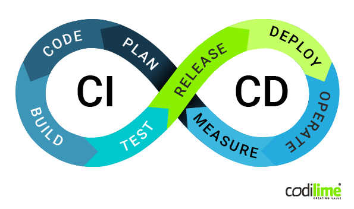

# pytorch_mnist

 

This project to design and describle a full CI/CD pipeline for a Python application with pytorch mnist component. 

# What is CI CD Pipeline?

A CI/CD pipeline is the practical implementation of DevOps principles. Below is a brief overview of what CI/CD stands for. 

Continuous Integration (CI) means using automation tools to build, test and merge code seamlessly. This is to ensure that code coming from different developers and components is free of errors. Automated tests help spot bugs at the early stage of software development and fix them immediately

Continuous Delivery (CD) is the practice of releasing software in short cycles, with greater speed and frequency. New code is released in smaller batches, even a few times a day. This makes it more bug-resistant and easier to manage.

CD also means Continuous Deployment, or the constant and automated production deployment of every change made to the code, ideally without any human intervention. This is Continuous Delivery taken to a new level of automation.

**Using GitHub Actions to implement an automated CI/CD pipeline**

GitHub Actions make it is easy to automate build, test and deploy project on any platform, including Linux, maxOS, and Windows. 

**Continuous integration**

Created my workflow file - python-app.yml for continious integration for my python application.

Every time when I commit my code, github action automatic run those jobs:
1.  Build code with pylint/flake8 steps to detect the errors.
2. 	Test the code with pytest: I cannot done this part and try to run python script. This is important step to make sure the update code pass the test when integrity with all previous code.
3.  For my project, I should train the model with different case from minimal dataset to full dataset. Everytime when I train the model, the github action automatically run the build, test steps.

jobs:
  build:

    runs-on: ubuntu-latest

    steps:
    - uses: actions/checkout@v2
    - name: Set up Python 3.x
      uses: actions/setup-python@v2
      with:
        python-version: 3.x
    - name: Install dependencies
      run: |
        python -m pip install --upgrade pip
        pip install flake8 
        if [ -f requirements.txt ]; then pip install -r requirements.txt; fi
    - name: Lint with flake8
      run: |
        # stop the build if there are Python syntax errors or undefined names
        flake8 . --count --select=E9,F63,F7,F82 --show-source --statistics
        # exit-zero treats all errors as warnings. The GitHub editor is 127 chars wide
        flake8 . --count --exit-zero --max-complexity=10 --max-line-length=127 --statistics
  

  test:
    name: Python ${{ matrix.python-version }} tests
    runs-on: ubuntu-latest
    strategy:
      matrix:
        python-version: [3.6, 3.7, 3.8]

    steps:
      - uses: actions/checkout@v2
      - name: Set up Python ${{ matrix.python-version }}
        uses: actions/setup-python@v1
        with:
          python-version: ${{ matrix.python-version }}
      - uses: actions/cache@v1
        with:
          path: ~/.cache/pip
          key: ${{ runner.os }}-pip-${{ hashFiles('setup.py') }}
          restore-keys: |
            ${{ runner.os }}-pip-
      - name: Install dependencies
        run: |
          # python -m pip install .[test]
          # python -m pip install pytest-github-actions-annotate-failures
          # - name: pytest
          #   run: python -m pytest -v tests
      - name: Display the path
        run: |
        shell: python {0}

**Continuous Deployment**

After completing the train and test model, release the code and then train and test the model on a cloud-hosted Kubernetes cluster. On the CD pipeline should also including build, test and devploy jobs. According train and test result from the cloud cluster, We will modify the code and repeat the CI/CD pipeline solution to delivery higher quality code.

I suppose to run the code on  cloud-hosted Kubernetes cluster under Docker container. Since I stucked pytest, I only tried to understand how it works.

Thanks for reading my report.

